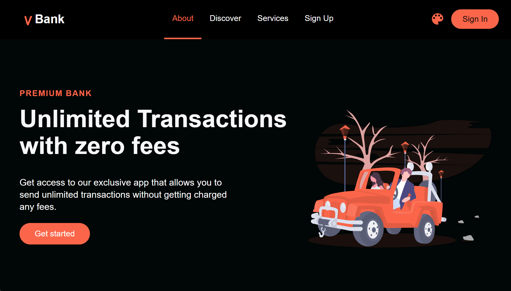
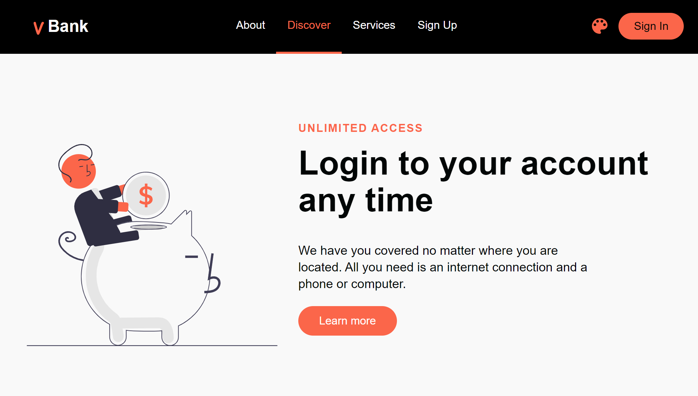
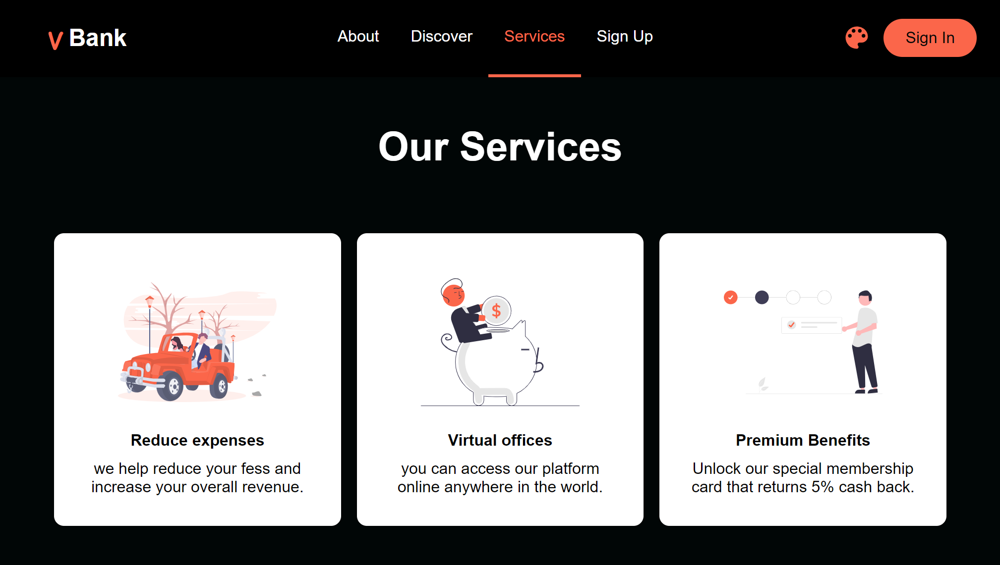
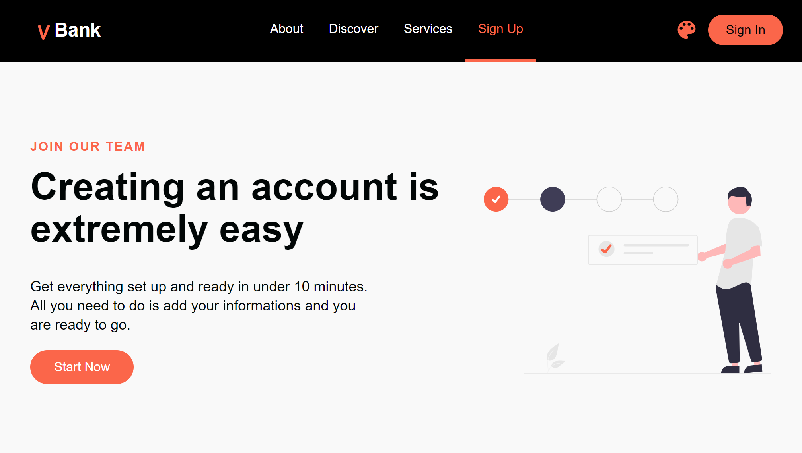
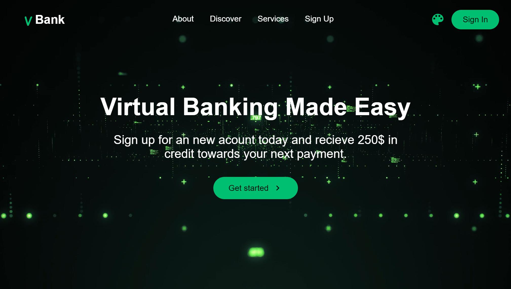
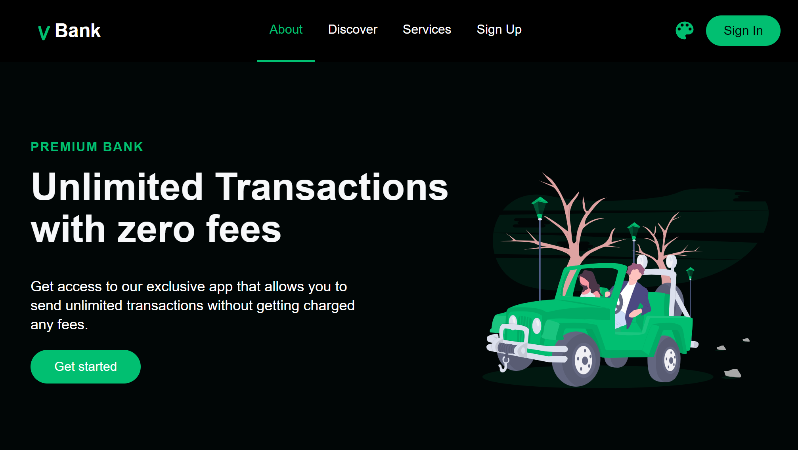
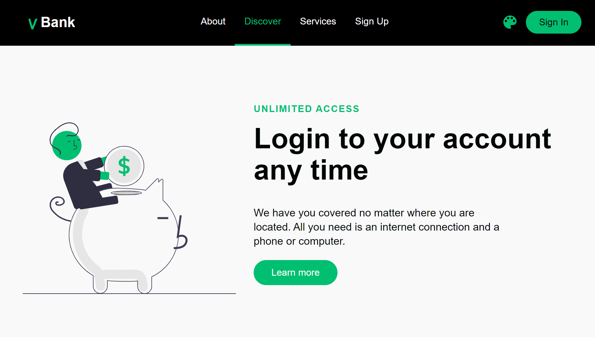
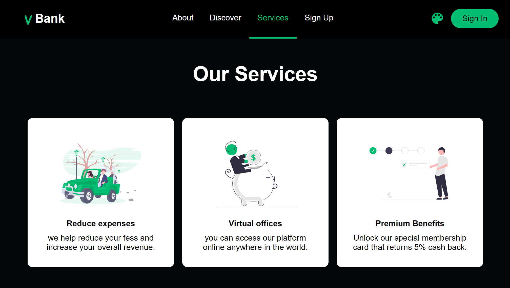

# Vbank - Redefining Banking with ReactJS and styled-components

Welcome to Vbank, where innovation meets seamless banking. 🚀 Built with ReactJS and styled-components, Vbank is not just a banking service – it's a modern, interactive, and visually stunning financial hub.

## Why Vbank?

- **ReactJS Power**: Experience swift navigation and dynamic user interaction with the robust capabilities of ReactJS.
- **Styled for Success**: Elevate your banking experience with visually appealing designs created using styled-components.

## Key Features

- 🌐 Intuitive UI: Navigate through your financial world effortlessly.
- 🔒 Security First: Your data is our top priority – Vbank ensures a secure banking environment.
- 🚀 Fast and Responsive: Enjoy a seamless and responsive banking experience, thanks to ReactJS.

## Getting Started

1. **Clone the Repository:**
   ```bash
   git clone https://github.com/younes-karir/React.js-Vbank.git
   
2. **Install Dependencies:**
   ```bash
   cd Vbank
   npm install
   
3. **Run the App:**
   ```bash
   npm start

## Screenshots











